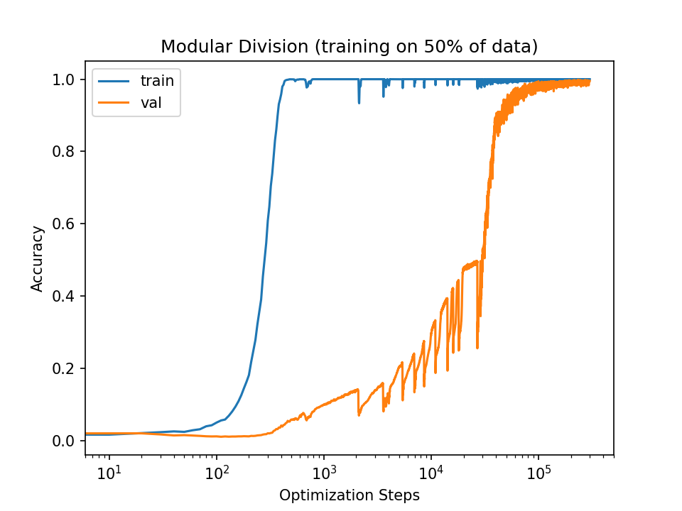
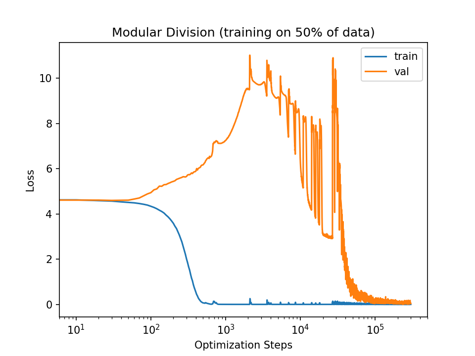

# Simple PyTorch Implementation of "Grokking"

Implementation of [Grokking: Generalization Beyond Overfitting on Small
Algorithmic
Datasets](https://mathai-iclr.github.io/papers/papers/MATHAI_29_paper.pdf)



## Usage

Running `train.py` with default arguments will run my best (yet) attempt to
reproduce the "Grokking" behavior on modular division as seen in Figure 1 of the paper.

```bash
python train.py
```

The results seem highly sensitive to optimizer hyperparameter selection, and I
have not yet tried all of the configurations outlined in the paper.


## Citations

```bibtex
@inproceedings{power2021grokking,
  title={Grokking: Generalization beyond overfitting on small algorithmic datasets},
  author={Power, Alethea and Burda, Yuri and Edwards, Harri and Babuschkin, Igor and Misra, Vedant},
  booktitle={ICLR MATH-AI Workshop},
  year={2021}
}
```


